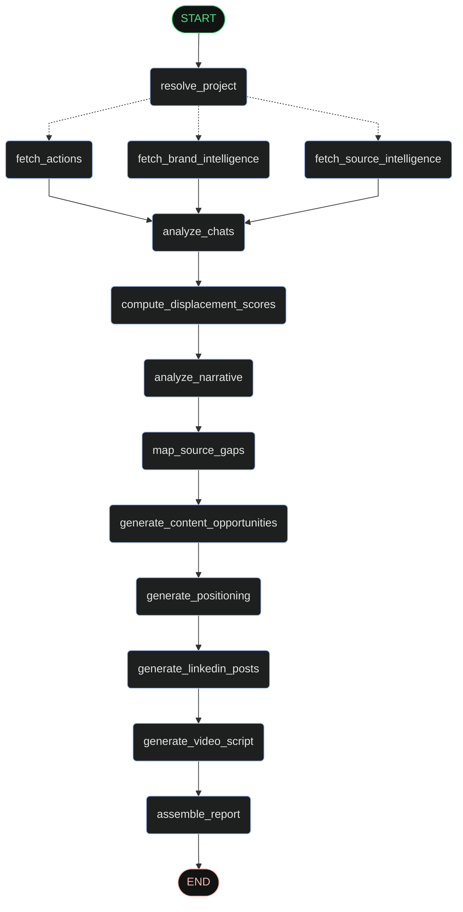

# EdgeElevate

> AI-powered Competitive Intelligence, Orchestrated for Distribution for startups to identify narrative gaps and amplify market presence using LangGraph and Peec AI.

EdgeElevate is a sophisticated intelligence platform that analyzes your competitive landscape, identifies strategic positioning gaps, and generates data-driven content to help early-stage brands win distribution against larger competitors.

## 1. Pipeline Execution Flow

The system operates as a **directed acyclic graph (DAG)** powered by LangGraph, transitioning through **4** primary logical stages and **13** specialized nodes.

| Frontend Stage                  | Backend Nodes Involved                                                                                                          | Primary Responsibility                                                  |
| :------------------------------ | :------------------------------------------------------------------------------------------------------------------------------ | :---------------------------------------------------------------------- |
| **Stage 1: Identifying Brand**  | `resolve_project`                                                                                                               | Mapping user input to Peec AI project entities.                         |
| **Stage 2: Gathering Intel**    | `fetch_brand_intelligence`, `fetch_source_intelligence`, `fetch_actions`                                                        | Parallel ingestion of raw Peec AI metrics and recommended actions.      |
| **Stage 3: Analyzing Gaps**     | `compute_displacement_scores`, `analyze_narrative`, `map_source_gaps`, `analyze_chats`                                          | Synthesis of raw data into proprietary competitive displacement scores. |
| **Stage 4: Generating Content** | `generate_content_opportunities`, `generate_positioning`, `generate_linkedin_posts`, `generate_video_script`, `assemble_report` | Multi-format content generation and final executive report assembly.    |

### System Orchestration Flow



**Tech Stack**: React 19, TypeScript, Tailwind • Python 3.11, FastAPI, LangGraph • Gemini 2.5 Flash • Peec AI • @nivo • Langfuse

## 2. Detailed Node Logic

### Data Ingestion Nodes

- **`resolve_project`**: Fuzzy matches user input against Peec AI project list.
- **`fetch_brand_intelligence`**: Normalizes Peec AI metrics (Visibility, Sentiment, Position, SOV).
- **`fetch_source_intelligence`**: Identifies high-authority domains (Wikipedia, Reddit, YouTube) AI engines cite most.
- **`fetch_actions`**: Retrieves recommended action groups (Owned, Editorial, UGC).

### Analytical Synthesis Nodes

- **`analyze_chats`**: Samples actual AI responses to see exactly _how_ a brand is described compared to competitors.
- **`compute_displacement_scores`**: Calculates the proprietary **Competitive Displacement Score (CDS)**.
- **`analyze_narrative`**: Extracts framing patterns and identifies "missing narratives."
- **`map_source_gaps`**: Categorizes domains into Missing High Authority, Battlegrounds, and Untapped Channels.

### Content Generation & Assembly Nodes

- **`generate_content_opportunities`**: Ranks 10 content ideas based on displacement potential and effort.
- **`generate_positioning`**: Crafts a "Winning Narrative" optimized for AI discoverability.
- **`generate_linkedin_posts`**: Drafts 3 posts (Data Insight, Founder Narrative, Product-Led).
- **`generate_video_script`**: Creates a script for YouTube, targeting competitor vulnerabilities.
- **`assemble_report`**: Synthesizes all analysis into a final executive-ready markdown report.

## 3. Proprietary Metric: Competitive Displacement Score (CDS)

EdgeElevate quantifies the **Ease of Displacement** using a weighted formula:

- **Visibility Gap (35%)**: Room for growth vs competitors.
- **Sentiment Delta (20%)**: Quality advantage ("The Quality Wedge").
- **Position Proximity (20%)**: Closeness in AI engine rankings.
- **Source Overlap (25%)**: Shared battleground domains.

## Getting Started

### Prerequisites

- Node.js (v18+)
- Python 3.11+
- API Keys: `OPENROUTER_API_KEY`, `PEEC_API_KEY`

### Installation

1. **Frontend Setup**:

   ```bash
   npm install
   ```

2. **Backend Setup**:

   ```bash
   cd backend
   python -m venv venv
   source venv/bin/activate
   pip install -r requirements.txt
   ```

3. **Environment**:
   Create a `.env` in the root and `/backend` directories with your API keys.

### Run Locally

1. Start the Backend:

   ```bash
   cd backend
   uvicorn api_server:app --reload --port 8000
   ```

2. Start the Frontend:
   ```bash
   npm run dev
   ```

## Project Structure

```
backend/
├── api_server.py           # FastAPI entry point
├── elevate_edge_graph.py   # LangGraph DAG definition
├── models.py               # Pydantic models for structured output
└── requirements.txt        # Python dependencies

src/
├── components/
│   ├── AnalysisFlow.tsx    # Pipeline progress UI
│   ├── Dashboard.tsx       # Main analytics view
│   └── charts/             # @nivo visualization components
└── services/
    └── edgeElevateApi.ts   # SSE streaming client
```

## License

MIT
